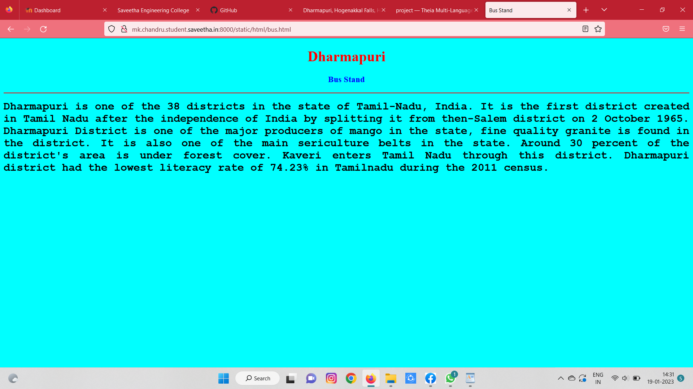

# Places Around Me
## AIM:
To develop a website to display details about the places around my house.

## Design Steps:

### Step 1:
Clone the github repository into Theia IDE

### Step 2:
create a new Django project

### Step 3:
write the needed HTML code.

### Step 4:
Run the Django server and execute the HTML files.

## Code:
'''
map.html
<!DOCTYPE html>
<html lang="en">
<head>
<title>My City</title>
</head>
<body>
<h1 align="center">
<b>Dharmapuri</b>
</h1>
<h3 align="center">
<b>Chandru M (22008631)</b>
</h3>

<map name="MyCity">
<area shape="circle" coords="190,50,20" href="/static/html/ghs.html" title="Govt. Higher Secondary School">
<area shape="rectangle" coords="230,30,260,60" href="/static/html/rto.html" title="RTO Office">
<area shape="circle" coords="400,350,50" href="/static/html/vk.html" title="Hogenakkal water falls">
<area shape="circle" coords="400,200,75" href="/static/html/bus.html" title="Bus Stand">
<area shape="rectangle" coords="490,150,870,320" href="/static/html/park.html" title="Eco-Park">
</map>

</body>
</html>

bus.html
<!DOCTYPE html>
<html lang="en">
<head>
<title>Bus Stand</title>
</head>
<body bgcolor="cyan">
<h1 align="center">
<b>Dharmapuri</b>
</h1>
<h3 align="center">
<b>Bus Stand</b>
</h3>

<b>
Dharmapuri is one of the 38 districts in the state of Tamil-Nadu, India.
It is the first district created in Tamil Nadu after the independence of India by splitting it from then-Salem district on 2 October 1965.
Dharmapuri District is one of the major producers of mango in the state, fine quality granite is found in the district.
It is also one of the main sericulture belts in the state. Around 30 percent of the district's area is under forest cover.
Kaveri enters Tamil Nadu through this district.
Dharmapuri district had the lowest literacy rate of 74.23% in Tamilnadu during the 2011 census.
</b>

</body>
</html>

park.html
<!DOCTYPE html>
<html lang="en">
<head>
<title>Eco-Park</title>
</head>
<body bgcolor="yellow">
<h1 align="center">
<b>Dharmapuri</b>
</h1>
<h3 align="center">
<b>Eco-Park</b>
</h3>

A very nice park near Dharmapuri bus stand. It is located surrounding the Hogenakkal water falls. 
Very superb calm place in dharmapuri. Best for walking. Nice playing place for kids.
Well maintained with jogging track. Source of ground water.
Good place play with children.  In Banyan Tree lot of parrot stay like house. 
Good sound and Air. Lake view park looks awesome.
Very nice place at Dharmapuri.
Simple and relax with play area.

</body>
</html>

rto.html
<!DOCTYPE html>
<html lang="en">
<head>
<title>RTO Office</title>
</head>
<body bgcolor="pink">
<h1 align="center">
<b>Dharmapuri</b>
</h1>
<h3 align="center">
<b>RTO Office</b>
</h3>

<b>
RTO office or the Regional Transport Office is a government body specifically established to oversee all transport-related operations in the country. RTOs are located throughout the country in each state and union territory. RTOs are responsible for enforcing the rules as laid down by the Motor Vehicle Act of 1988.
The department also maintains a database of all the vehicles operating in the country as well as issues licenses for drivers. Besides, the RTO office also collects road taxes, supervises pollution checks, and ensures the enforcement of all road transportation rules. If you own or drive a vehicle in India, you will need to visit the RTO to get your vehicle registered, obtain a driver’s license or renew your driver’s license, etc.
RTOs are also responsible for improving road and vehicle safety, especially to avoid accidents and other road fatalities.
</b>

</body>
</html>

ghs.html
<!DOCTYPE html>
<html lang="en">
<head>
<title>Govt. High. Sec. School</title>
</head>
<body bgcolor="lime">
<h1 align="center">
<b>Dharmapuri</b>
</h1>
<h3 align="center">
<b>Government Higher Secondary School</b>
</h3>

The main uses of Dharmapuri Government Higher Secondary School are 
<ul>
<li>To get good jobs or college after completeing their education.</li>
<li>To give discpline to the childern.</li>
<li>To grow up their knowledge and extra curriculum.</li>
<li>To give education to all the childern.</li>
</ul>

</body>
</html>

vk.html
<!DOCTYPE html>
<html lang="en">
<head>
<title>Hogenakal water falls</title>
</head>
<body bgcolor="orange">
<h1 align="center">
<b>Dharmapuri</b>
</h1>
<h3 align="center">
<b>Hogenakal water falls</b>
</h3>

The uses of Hogenakal water falls in Dharmapuri District are 
<ol type="1">
<li> Hogenakal water used for drinking.</li>
<li>It is an exiting place for tourist.</li>
<li>Pisculture.</li>
<li>For bathing, washing clothes etc.</li>
</ol>

</body>
</html>
'''

## Output:

## HTML Validator

## Result:
The program for implementing image map is executed sucessfully